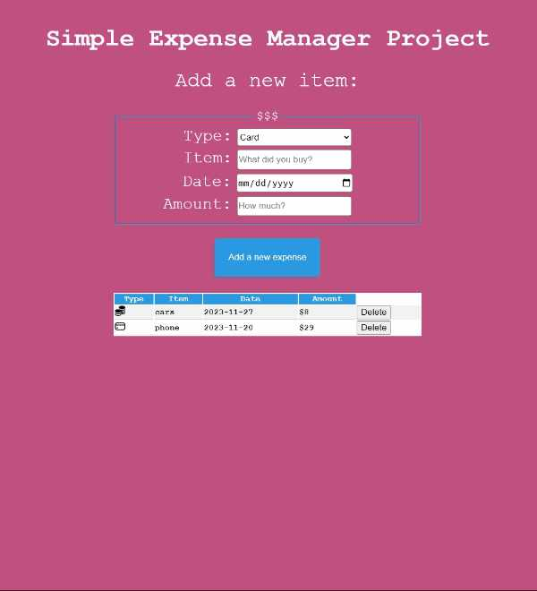

This is Project Four for SDMM - Expense Tracking App
============================
### About

-This is a basic expense tracker built using JavaScript, HTML & CSS
-No Frameworks used.

**Focus on simplicity and getting the app to work.**

Here is my working application:  [My Expense Tracker App](https://erickarodom.github.io/JSExpenseTrackerApp/)

 ## Guidelines
 - 🕰 Completion time is 1-3 week.
 - 📚 No libraries or frameworks.
 - 
 -  Don't follow a tutorial or copy someone elses project code.

## Summary
This is a JS expense tracker. The user can select from a selection of currencies, enter details about the item purchased, and add the item to a table that displays the items.
These are the highlights of this project: 
-Naturally builds on skills/knowledge used building a JS ToDo App.
-HTML, CSS scaffolding on this project is basic and quick.  Definately room to get creative.
-The JavaScript for this project required me to stretch my JS logic muscles, easily the best part of this project:
 -breaking down the functionality into digestable pieces.
 -while building the smaller pieces my understanding of functions, function scope, data type selection, and using loops was greatly enhanced!

[My Live Application](https://erickarodom.github.io/JSExpenseTrackerApp/)

## License
Distributed under the MIT License.

## Contact Developer
[![LinkedIn][linkedin-shield]][linkedin-url]   or  Email me: <a href="mailto:ericka.r.odom@gmail.com">📧</a>

[//]: # (Just testing writing comments?)

[linkedin-shield]: <https://img.shields.io/badge/-LinkedIn-black.svg?style=for-the-badge&logo=linkedin&colorB=555>
[linkedin-url]: https://linkedin.com/in/ericka-odom

  
   
 

